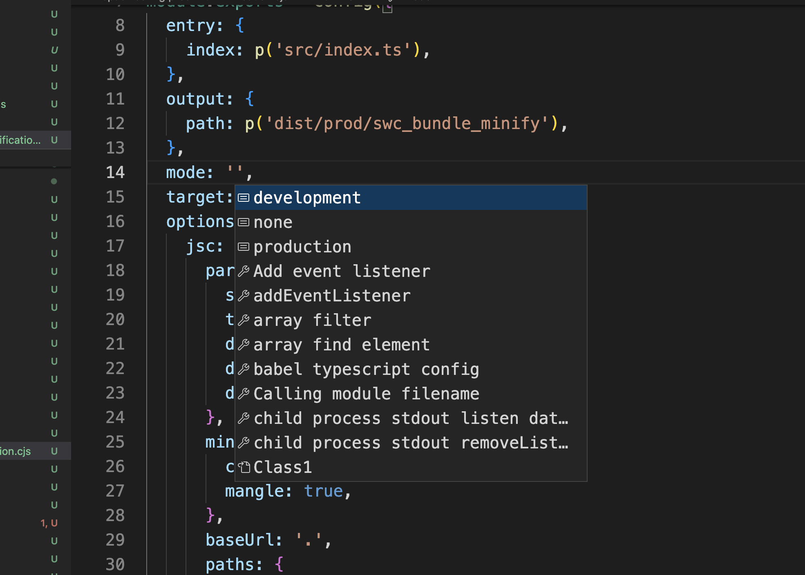

# Wepback & Swcpack bundling and exposing a library for browser


<hr>

This whole repository is a Demo and playground and a check for how to use `webpack` and `Swcpack` to `bundle` a `library` for `browser`. And **compare the output of the two**. And **what is possible and not possible yet** with `swcpack`.

It's part of `the Magician dev` learning series.

**keywords:**<br>
new gen transpilers, swc, swcpack, esbuild, webpack, vite, babel, bundling library, umd, swcpack problems, umd in swc, umd globals, webpack with swc, loader, benchmark, production, minification, compression, mangling. ...


I'll be trying to resume a lot of elements bellow:

## Webpack

`Webpack` have been there for an eternity. And is both mature and it's echo-system. `Webpack` is or was the defacto for so long. Used by `create-react-app`, `laravel-mix`, `vue-cli`, `nextjs`, `expo web (for react-native-web in expo)`, and the list is huge (mostly who wasn't using webpack).

`New generation tools` entered the Arena from so long. Mainly `esbuild` and `swc`.

Then `tools that wrap and use those` => the biggest that caught big traction is `vite`.

## Webpack vs esbuild vs vite vs swcpack

`vite` is the new comer that combine `esbuild` and `rollup`. `esbuild` for pre-bundling and transpilation and development. `vite` is using `esbuild`. `nextjs` and `parcel` are using `swc`. `Swc` is more focused to be a drop replacement to `babel`.

Why vite went with `esbuild` and not `swc` ? => [to be answered later]

(I guess mainly to keep one tool, and `esbuild` as does great with transpilation and minification (minification higher order faster then with terser and uglify [go vs js]), and as good relatively as `swc` [swc and esbuild are close, and in benchmark one would win over the other depending in the cases]). Also `esbuild` is focused into bundling and was out there long as such. While `swc` => transpilation first and replacing babel.

swc as a babel drop replacement is the only one to look at in the area. Adopted also by `nextjs`, and by `expo` for web and have loader for `jest`, `webpack` (to speed `webpack`, instead of using `babel` ...), ...

`Vite` way faster then `webpack` =>
  mainly due to usage of `esbuild` for pre-bundling. And for loading the development server before crawling all the files.

  - vite use rollup for bundling
  - that give stability and also flexibility ...

While vite promote itself as fast and raise the development experience => Webpack can be as much as fast:

The article below show some benchmarks:

https://javascript.plainenglish.io/migrating-a-150k-loc-codebase-to-vite-and-esbuild-is-it-worthwhile-part-3-3-5a12894bac96

https://gist.github.com/NoriSte/24ddd3585249f439f285a563bee26591#file-final-benchmark-md

with `esbuild-loader` used for webpack. May be the result gonna be better with `swc-loader`.

However the first load time in development, `vite` is king. But what about `webpack` also catching in that area? Doesn't seems too fetched to manage.

`Vite` however for sure is catching a lot of traction and seems to be more developer friendly (DX).

What about vite vs (webpack + swc) ?

`Swcpack` (`spack`)
  - swc come with an experimental bundler called `swcpack`, `spack`. And it's not ready yet for production. And it's in development.
  - In this repo we tried to explore what can be done and what are the problems and how it does compare to `webpack` and what are the things in `webpack` that `swcpack` doesn't support. Or what actually it's supporting ....

# Webpack and swcpack our demo and playground

## Web script vs web library

### Script
Bundling something like `react` or any normal `script` that is intended to run in the `browser` and execute and run right away doing things. Like any `script` to handle the application functions and logic and dynamic aspect.

That's bundling a `script`. In such case you go with just precising output. And you don't need to do any extra thing.

In our Demo you would see that with the configurations bellow:

`Webpack`:
- webpack.config.cjs
- webpack.config.prod.cjs (prod)

`Swcpack`:
- spack.config.cjs
- spack.config.prod.cjs (prod)
- spack.config.prod.withMinification.cjs (using minification) [and problems with minification]
- ... 

`swc`:
- swcrc.minify.browser.json (using swc to minify and do umd after the bundling) [workaround]

`swcpack` doesn't support library exposition. And so all configurations are going script like.

In the one going with `.lib` i tried some options to see if they can help.

I made a workaround. Check the workaround section bellow.


### Lib

If we are to build a library, like `jquery`,` Snapman.js`, `Lodash` ...

Then => We need to expose the entry module to the global scope

In `webpack` this is done through adding a `library` prop to the output. And for more advanced use cases there is plugin for it.

In this repo we used `config.output.library`.

> `Swcpack` have no equivalent at the moment.<br>
> To Manage i opted for a workaround. Where i created a index.browser.ts to expose the variables manually. And basically run `swcpack` with the script bundling. (You can check the result in ) 

`webpack`:
- webpack.lib.config.cjs
- webpack.lib.config.prod.cjs

`swcpack`:
- spack.lib.config.cjs (tired some options elements)
- spack.lib.browser.config.cjs (workaround)

## Bundling a script for web

`Webpack` support it well. Check [webpack.config.cjs](./webpack.config.cjs) for example.


`swcpack` support it but (following my experiment. I may update that. If i find otherwise):
- no Isolation using `IIFE`
- Mangling doesn't work fully with `swcpack` (work great with `swc`). **Workaround**: `swcpack` bundling => output => swc => final output.
- `mode` => as mentioned in documentation does nothing at the moment. => production can go by setting the `minification` options. And `optimization`. 

## Bundling a library for web

- `Webpack` have `output.library`<br>
  check [webpack.lib.config.cjs](./webpack.lib.config.cjs)


- `swcpack` have no equivalent. And doesn't support it at all.

Two possible workaround:

```
swcpack => output => swc => minified umd output
```
by transpilling to a `umd` module. That would bind the exports to the global `window`, `globalThis`, and `this`

## executing and bundling

After

```sh
pnpm install
```

use 

```sh
npm run build:all
```

to build all.

Otherwise:

```json
"build:all": "npm-run-all --parallel webpack webpack:** swcpack swcpack:** swc:** --serial swcm:**",
"webpack": "webpack --config webpack.config.cjs",
"webpack:prod": "webpack --config webpack.config.prod.cjs",
"webpack:lib": "webpack --config webpack.lib.config.cjs",
"webpack:lib:prod": "webpack --config webpack.lib.config.prod.cjs",
"swcpack": "spack --config=$PWD/spack.config.cjs",
"swcpack:prod": "spack --config=$PWD/spack.config.prod.cjs",
"swcpack:prod:minify": "spack --config=$PWD/spack.config.prod.withMinification.cjs",
"swcm:prod:minify:minified_bundle": "swc dist/prod/swc_bundle_minify/index.js --out-file dist/prod/swc_bundle_minify/index.swcMinify.js --config-file swcrc.minify.browser.json",
"swcpack:lib": "spack --config=$PWD/spack.lib.config.cjs",
"swcpack:lib:browser": "spack --config=$PWD/spack.lib.browser.config.cjs",
"swc:build:umd": "swc src --out-dir dist/swc-umd --config-file swcrc.umd.json"
```

## Output

You can check the output at [./dist](./dist) directory

All well named to see too webpack output and swcpack output.

The code source examples are simple so that no extra heavy dependency go in. You can see how webpack structure and go about bundling and module resolution and loading using the cache.

And swcpack does none of the module resolution.

Check first the no prod (not minified) versions. So you get an idea how the bundling happen and what webpack does and how does swcpack compare.

Already mentioned. As shown here [dist/webpack_bundle/index.js](./dist/webpack_bundle/index.js)

And swcpack equivalent [dist/swc_bundle/index.js](./dist/swc_bundle/index.js)

And for lib:

webpack: [dist/lib/webpack_bundle](./dist/lib/webpack_bundle/index.js)


## Lib workaround for swcpack

Umd issue discussion:

https://github.com/swc-project/swc/discussions/3264

### Workaround 1

Creating [src/index.browser.ts](./src/index.browser.ts)

- Adding manually the variables. And import the original typescript exposing `index.ts`
- `swcpack` will bundle it as a `script`. But this time the variables are added to the global scope

Problem with that: => `swcpack` is not wrapping anything in `IIFE` for isolation (All variables [classes] are polluting the global scope, and that's a serious problem). You can compare against the webpack version. That's something that we can add manually. But still. And i couldn't figure out any way to add that `IIFE` through `swcpack`.

### Workaround 2

`entry` => `swcpack` => many files => no `IIFE` bundle output => `swc` => `umd` output

> `SWC` handle `umd` all well. But not `swcpack`. So one option is to combine them. (Not really an option but a workaround. As `swcpack` is experimental and work in progress. The development is going slow because the focus is more into `swc` and replacing `babel` first. As more of production solutions are using `swc` in place of `babel` (directly, for speeding `webpack`, ...))

Problem:

The `umd` factory does create the module in `global.fileName` and not the module name that you would want to have.

In my case it was an `index.js` file. So i got:

`global.index`

```ts
(function(global, factory) {
    if (typeof module === "object" && typeof module.exports === "object") factory(exports);
    else if (typeof define === "function" && define.amd) define([
        "exports"
    ], factory);
    else if (global = typeof globalThis !== "undefined" ? globalThis : global || self) factory(global.index = {}); // <=======================/ here
})(this, function(exports) // ...
```

With a file `HeroJs.js` we get:

```ts
else if (global = typeof globalThis !== "undefined" ? globalThis : global || self) factory(global.heroJs = {});
                                //------------/^
```

In case of `HeroJs.some.js` => `global.heroJsSome`

Note the name is with first character in lower case (camel case and not pascal case)

So basically for the workaround to work well we need to 

```js
entry => spack => bundle <with Library Name> => swc => final umd.
```


I tried different ways to try changing the name using the `swcrc` configuration. Not sure it is possible.

There is the `globals` variable.

And in `babel` the flowing plugin is used: https://babeljs.io/docs/en/babel-plugin-transform-modules-umd

And supposed to be used as:

```ts
{
  "plugins": [
    [
      "@babel/plugin-transform-modules-umd",
      {
        "globals": {
          "es6-promise": "Promise"
        }
      }
    ]
  ]
}
```

exposing `global.Promise` rather than the default `global.es6Promise`


At first i tried:

```ts
"globals": {
  "index": "HeroJs"
}
```
```ts
"globals": {
  "globalThis": "this"
}
```
```ts
"globals": {
  "globalThis": "HeroJs"
}
```
```ts
"globals": {
  "main": "HeroJs"
}
```
```ts
"globals": {
  "this": "HeroJs"
}
```

Nothing work lol. At first i didn't know how globals were to be used. Then i search for `babel` umd.

```ts
"globals": {
  "index": "HeroJs"
}
```
Should work. But it doesn't in `swc`.

Along that i tried the following variations:

```ts
"globals": {
  "./dist/swc_bundle/index.js": "HeroJs"
}
```

```ts
"globals": {
  "$PWD/dist/swc_bundle/index.js": "HeroJs"
} // Yea yea! but i tried it anyway
```

```ts
"globals": {
  "./index.js": "HeroJs"
}
```

```ts
"globals": {
  "index.js": "HeroJs"
}
```

None works.

You can try in [this playground](https://play.swc.rs/?version=1.3.23&code=H4sIAAAAAAAAA52S3WqEMBCF732KqVdZWITN7dIrKfQB9n4JIa5SycgYuy2L796JSST2vxUxP%2BckZz6TZrLadWjhrHs1jrXq%2B7o1%2Bkl0dnTKarOHGrlLk3ZIO7gVwE%2FXgLhbLZA62GzMye0f1xJewZornF4H80CEJMpaWYsONIeCgqUAUPxCE6sqd8dlh7mYi2dFUHvLAe5Xg0gZ5TQa4OROuzKsSZa4SOTVvId1bTfuo3GN9F8feh4IHXJo0Ktl6JgiGINcXTArCy64ySPjJrJwiFuHJk6GXY%2FFLDh5hZT%2FgZS%2FhZQ%2FQMovIPmYyeWcy8TfUGWG%2Bmho89v8%2BBvaz4n8osjjJyrtL4i%2Faengc03mmvQal2heBmSuW7pffAdj74MoV1FuxIWEpaVl4Q2cY2xrWAMAAA%3D%3D&config=H4sIAAAAAAAAA0WNTQoDIQxG75K1tKtu5gSl0ENYJyMW%2F0gUKuLdJxZLVwnf9%2FLS4c0Gtg5ZEyPNjVss%2BgMboAmaDblcQAkm0aE941BQNFksE%2BGbdD4lxtUqCC66o02TSSETMv8rHa3%2FkUNEIe11Bh1KyzKhhl2E1qeXIDO%2FXF3Mdf66I6UHw%2FdsvVhax8%2FlKVRxnHTJxXTUAAAA)

You can see that `input` is picked up. Because of file naming.

I filled an issue here: https://github.com/swc-project/swc/issues/6697

I confirmed by checking the code source that it is not implemented. As i have shown in the issue.

[crates/swc_ecma_transforms_module/src/umd/config.rs#L75](https://github.com/swc-project/swc/blob/d8fc0298e2f7ca031faee0e06c531030fc72d39d/crates/swc_ecma_transforms_module/src/umd/config.rs#L75)

[crates/swc_ecma_transforms_module/src/umd.rs#L117](https://github.com/swc-project/swc/blob/d8fc0298e2f7ca031faee0e06c531030fc72d39d/crates/swc_ecma_transforms_module/src/umd.rs#L117)

Now it's time for a PR.

#### filename and sourceFileName

What about `--filename (-f)` and `--source-file-name` cli arguments ? ==> I tried them but it does nothing. => doesn't work.

## Webpack and swc

Remember that for the time combining webpack with `swc-loader` is still a good option. https://swc.rs/docs/usage/swc-loader. For any transpilation based work. replacing `babel-loader` with `swc-loader` would make difference in performance in that related work.

# Swcpack

## Things that i tried for umd and building for lib

### module

```ts
module: {
  type: 'umd',
  // globals: {
  //   HeroJs: 'default',
  // },
},
```

whole module thing doesn't work. Not even just globals (by the way i have no idea what globals do there. I just tried. ). And even if you comment it out doesn't matter. Or you choose `type: 'commonjs'`. Doesn't work in swcpack.

### isModule
```ts
isModule: true,
```
Does nothing. `true` or `false`.

### Compiling to umd using swc and module naming

## Porblems with swcpack as of the current time (December 2022)

Will try to update this section on the go.

### mode development doesn't work

unknown variant `development`, there are no variants at line 1 

=> you have to use `none` | `debug` | `production` or not set it. And that would output development.

otherwise `production` (no problem with `production` value).

error:
```
/Users/mohamedlamineallal/repos/webpack-test-simple-output/node_modules/.pnpm/@swc+core@1.3.23/node_modules/@swc/core/index.js:313
            return bindings.bundle(toBuffer(Object.assign({}, opts)));
                            ^

Error: Failed to deserialize buffer as binding_core_node::bundle::StaticConfigItem
JSON: {"entry":{"index":"/Users/mohamedlamineallal/repos/webpack-test-simple-output/src/index.ts"},"output":{"path":"/Users/mohamedlamineallal/repos/webpack-test-simple-output/dist/swc_bundle","name":"[name].js"},"mode":"development","target":"browser","options":{"jsc":{"target":"es5","parser":{"syntax":"typescript","tsx":false,"decorators":true,"dts":true,"dynamicImport":true},"baseUrl":".","paths":{"/*":["./src/*"]}},"sourceMaps":true,"isModule":true}}

Caused by:
    unknown variant `development`, there are no variants at line 1 column 452
    at Compiler.<anonymous> (/Users/mohamedlamineallal/repos/webpack-test-simple-output/node_modules/.pnpm/@swc+core@1.3.23/node_modules/@swc/core/index.js:313:29)
    at Generator.next (<anonymous>)
    at fulfilled (/Users/mohamedlamineallal/repos/webpack-test-simple-output/node_modules/.pnpm/@swc+core@1.3.23/node_modules/@swc/core/index.js:31:58) {
  code: 'GenericFailure'
}
```

env:

```json
"node_version": "v19.3.0",
"@swc/cli": "^0.1.57",
"@swc/core": "^1.3.23",
```

At the current time the option does nothing:

https://swc.rs/docs/configuration/bundling#mode

mentioned in the doc

> Currently this value is not used, but it will behave similarly to webpack.


The typescript is wrong. Or the doc is `debug` to `development`.



### mangling options doesn't work

`swc` command work just fine and mangle well. But not when `spack` is used.

Only minification and compression is working.

This is an output

```js
function _classCallCheck(instance,Constructor){if(!(instance instanceof Constructor)){throw new TypeError("Cannot call a class as a function")}}var Class1=function(){"use strict";function t(){_classCallCheck(this,t)}return t.prototype.go=function(){return 1},t}();var Class2=function(){"use strict";function t(){_classCallCheck(this,t)}return t.prototype.start=function(){return 1},t}();var Hero=function r(){"use strict";_classCallCheck(this,r),this.c1=new Class1,this.c2=new Class2};export{Class1 as Class1,Class2 as Class2};export{Hero as Hero};
```

That came from this configuration

```js
const { config } = require('@swc/core/spack');

const path = require('path');

const p = (relativePath) => path.resolve(__dirname, relativePath);

module.exports = config({
  entry: {
    index: p('src/index.ts'),
  },
  output: {
    path: p('dist/prod/swc_bundle_minify'),
  },
  mode: 'production',
  target: 'browser',
  options: {
    module: {
      type: 'umd',
    },
    jsc: {
      parser: {
        syntax: 'typescript',
        decorators: true,
        dynamicImport: true,
        tsx: false,
      },
      minify: {
        compress: true,
        mangle: true,
      },
    },
    minify: true,
    isModule: true,
  }
});
```

and same output for:

```ts
minify: {
  compress: true,
  mangle: {
    keep_classnames: false,
    keep_private_props: false,
    keep_fnames: false,
    reserved: undefined,
    toplevel: true,
  },
  ecma: 'es5',
},
```

If i use the workaround of bundling first minifying then using `swc` using the same configuration. We will get the following output in `umd` format:

```ts
!function(n,t){"object"==typeof module&&"object"==typeof module.exports?t(exports):"function"==typeof define&&define.amd?define(["exports"],t):(n="undefined"!=typeof globalThis?globalThis:n||self)&&t(n.index={})}(this,function(n){"use strict";function t(n,t){if(null!=t&&"undefined"!=typeof Symbol&&t[Symbol.hasInstance]?!t[Symbol.hasInstance](n):!(n instanceof t))throw TypeError("Cannot call a class as a function")}Object.defineProperty(n,"__esModule",{value:!0}),function(n,t){for(var e in t)Object.defineProperty(n,e,{enumerable:!0,get:t[e]})}(n,{Class1:function(){return e},Class2:function(){return o},Hero:function(){return i}});var e=function(){"use strict";function n(){t(this,n)}return n.prototype.go=function(){return 1},n}(),o=function(){"use strict";function n(){t(this,n)}return n.prototype.start=function(){return 1},n}(),i=function n(){"use strict";t(this,n),this.c1=new e,this.c2=new o}});

//# sourceMappingURL=index.swcMinify.js.map
```

### umd, and module format is not working

That it is `umd` like shown by the precedent section or `cjs` format. `swcpack` seems not picking up the `module` option.

==> swc manage well
==> swcpack doesn't


### keep keep_fnames keep_classnames wrong typescript typing

/Users/mohamedlamineallal/repos/webpack-test-simple-output/node_modules/.pnpm/@swc+core@1.3.23/node_modules/@swc/core/index.js:313
            return bindings.bundle(toBuffer(Object.assign({}, opts)));
                            ^

Error: Failed to deserialize buffer as binding_core_node::bundle::StaticConfigItem
JSON: {"entry":{"index":"/Users/mohamedlamineallal/repos/webpack-test-simple-output/src/index.ts"},"output":{"path":"/Users/mohamedlamineallal/repos/webpack-test-simple-output/dist/prod/swc_bundle_minify","name":"[name].js"},"mode":"production","target":"browser","options":{"jsc":{"parser":{"syntax":"typescript","tsx":false,"decorators":true,"dts":true,"dynamicImport":true},"minify":{"module":true,"keep_fnames":false,"keep_classnames":false,"toplevel":true,"compress":true,"mangle":true},"baseUrl":".","paths":{"/*":["./src/*"]}},"minify":true,"sourceMaps":true,"isModule":true}}

Caused by:
    unknown field `keep_fnames`, expected one of `compress`, `mangle`, `format`, `ecma`, `keepClassnames`, `keepFnames`, `module`, `safari10`, `toplevel`, `sourceMap`, `outputPath`, `inlineSourcesContent`, `emitSourceMapColumns` at line 1 column 577
    at Compiler.<anonymous> (/Users/mohamedlamineallal/repos/webpack-test-simple-output/node_modules/.pnpm/@swc+core@1.3.23/node_modules/@swc/core/index.js:313:29)
    at Generator.next (<anonymous>)
    at fulfilled (/Users/mohamedlamineallal/repos/webpack-test-simple-output/node_modules/.pnpm/@swc+core@1.3.23/node_modules/@swc/core/index.js:31:58) {
  code: 'GenericFailure'
}

```ts
// doesn't work
minify: {
  module: true,
  keep_fnames: false,
  keep_classnames: false,
  toplevel: true,
  compress: true,
  mangle: true,
},
// does work
minify: {
  module: true,
  keepFnames: false,
  keepClassnames: false,
  toplevel: true,
  compress: true,
  mangle: true,
},
```

# SWC problems

## Disabling source map not working

disabling source map generation not working.
setting `"sourceMaps": false` does nothing.

can be checked in:<br>
[swcrc.minify.browser.json](./swcrc.minify.browser.json)

# Swcpack questions

What does setting `mode` to `production` do ?
(doesn't trigger minification ...., Minification can be set through )